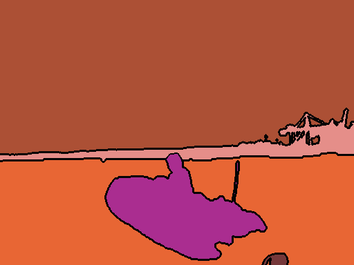
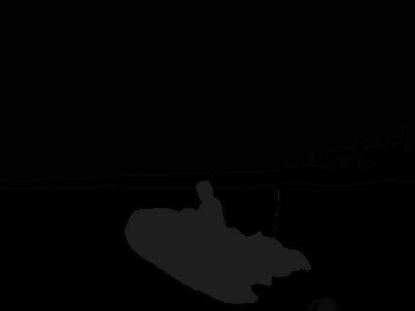

# PanopticCocoCreator

PanopticCocoCreator is used for generating COCO panoptic.json and instances.json files out of already prepared
grayscale or RGB panoptic segmentation masks. If the the masks are grayscale, the program will automatically generate new
RGB masks, with randomly generated colors, in to "rgb_mask_output" folder that will match the information in generated panoptic.json
and instances.json files. These new RGB images should be used to train your model. If your input masks are already RGB format then new RGB masks will NOT be 
generated and you can use your original masks to train your model along with panoptic.json and instances.json files. 

The program expects that all your classes have consistent colors on every image. 
So for example if you use the color (253,45,34) for an instance of a boat, it expects that that color is always used for
boats in every image. The same applies in grayscale where an instance of a boat would represent the value 120 for example.
The same instance does not have to have the same color in every image. Only the classes need to match. How classes are defined is
further explained in the Usage chapter below.

The format of panoptic.json and instances.json files can be seen at https://cocodataset.org/#format-data under the "Object Detection"
and "Panoptic Segmentation" sections.

panoptic.json
```json 
annotation{
    "image_id": int, 
    "file_name": str, 
    "segments_info": [segment_info],
}

segment_info{
    "id": int,
    "category_id": int, 
    "area": int, 
    "bbox": [x,y,width,height], 
    "iscrowd": 0 or 1,
}

categories[{
    "id": int, 
    "name": str, 
    "supercategory": str, 
    "isthing": 0 or 1, 
    "color": [R,G,B],
}]
```

instances.json

```json
annotation{
    "id": int,
    "image_id": int,
    "category_id": int,
    "segmentation": RLE or [polygon], 
    "area": float, 
    "bbox": [x,y,width,height], 
    "iscrowd": 0 or 1,
}

categories[{
  "id": int, 
  "name": str, 
  "supercategory": str,
}]
```


## Installation

Python version 3.6.


Use the package manager [pip](https://pip.pypa.io/en/stable/) to install the following packages. 

```bash
pip install numpy==1.19.5
pip install pycocotools-windows==2.0.0.2
pip install opencv-contrib-python==4.5.4.58
pip install imantics==0.1.12
pip install pycocotools==2.0.2
```

## Usage

The program uses a config dictionary generated in **config_creator.py** that you can use to specify which conversion type you would like to use, which classes
are present in the images and what values they take up. After config is set up simply run **convert.py**.


You can define as many values (colors) for each class as you like, even if they
aren't present in your masks, as long as they do not overlap between classes.


As explained above, if you select _"masks_channels": "grayscale"_ then you will have to specify the _"rgb_mask_output"_ 
output folder, where new RGB masks will be generated. If you don't use grayscale masks then _"rgb_mask_output"_ will be ignored.

_"colors:"_ is a list of values for each instance in your masks. 
As shown in the example below, if you use grayscale images then an instance of a "boat" can be any value between 30 and 50.
If you use RGB images than the instances in your "boat" will be defined by RGB values (170, 45, 144), (165, 251, 109), (223, 232, 194), (34, 95, 131), (152, 173, 10), (177, 21, 86).
The instance values do NOT need to match between masks. You can color the same "boat" with value 30 in one mask and then 41 in the next mask.

For the meaning of _"isthing"_ and _"iscrowd"_ you can read at https://cocodataset.org/#format-data

```python
config={}

config["cfg"] = {
        # Folder where there panoptic.json and instances.json will be generated 
        "json_output_folder": "d:/Segmentacija/panoptic-deeplab-master/tools_d2/datasets/coco/annotations/",
        # Folder where your images are located
        "images_folder": "f:/Segmentacija/best/train_mastr1325/",
        "images_file_type": "jpg",
        # Folder where your RBG or grayscale panoptic segmentations masks are located
        "masks_folder": "f:/Segmentacija/panoptic-deeplab-master/tools_d2/datasets/coco/panoptic_train/",
        "masks_file_type": "png",
        # What type of masks are you using. "grayscale" or "rgb"
        # "masks_channels": "grayscale",
        "masks_channels": "rgb",
        # If you select "masks_channels": "grayscale" the program will generate RGB masks, along with the json files in this folder.
        "rgb_mask_output": "f:/Segmentacija/panoptic-deeplab-master/tools_d2/datasets/coco/panoptic_train/",
    }


# Defined classes if masks are "grayscale". If other are selected, this will be ignored. 
config["classes"] = [
    {"color": [0], "isthing": 0, "iscrowd": 0, "id": 1, "name": "obstacles_and_environment"},
    {"color": [1], "isthing": 0, "iscrowd": 0, "id": 2, "name": "water"},
    {"color": [2], "isthing": 0, "iscrowd": 0, "id": 3, "name": "sky"},
    {"color": [4], "isthing": 0, "iscrowd": 0, "id": 4, "name": "ignore"},
    {"color": list(range(10, 30)), "isthing": 1, "iscrowd": 0, "id": 4, "name": "ship_part"},
    {"color": list(range(30, 50)), "isthing": 1, "iscrowd": 0, "id": 5, "name": "boat"},
    {"color": list(range(50, 70)), "isthing": 1, "iscrowd": 0, "id": 6, "name": "buoy"},
    {"color": list(range(70, 90)), "isthing": 1, "iscrowd": 0, "id": 7, "name": "ship"},
    {"color": list(range(90, 110)), "isthing": 1, "iscrowd": 0, "id": 8, "name": "floating_fence"},
    {"color": list(range(110, 130)), "isthing": 1, "iscrowd": 0, "id": 9, "name": "unknown_object"},
    {"color": list(range(130, 150)), "isthing": 1, "iscrowd": 0, "id": 10, "name": "yacht"},
    {"color": list(range(150, 170)), "isthing": 1, "iscrowd": 0, "id": 11, "name": "water_scooter"},
]

# Defined classes if masks are "rgb". If other are selected, this will be ignored.
config["classes_rgb"] = [
    {"color": [(229, 142, 137)], "isthing": 0, "iscrowd": 1, "id": 1, "name": "obstacles_and_environment"},
    {"color": [(232, 102, 52)], "isthing": 0, "iscrowd": 0, "id": 2, "name": "water"},
    {"color": [(172, 80, 53)], "isthing": 0, "iscrowd": 0, "id": 3, "name": "sky"},
    {"color": [(58, 111, 127)], "isthing": 0, "iscrowd": 0, "id": 4, "name": "ignore"},
    {"color": [(118, 56, 58)], "isthing": 1, "iscrowd": 0, "id": 4, "name": "ship_part"},
    {"color": [(170, 45, 144), (165, 251, 109), (223, 232, 194), (34, 95, 131), (152, 173, 10), (177, 21, 86)], "isthing": 1, "iscrowd": 0, "id": 5, "name": "boat"},
    {"color": [(74, 2, 33), (87, 141, 49), (130, 204, 215), (178, 0, 228)],  "isthing": 1, "iscrowd": 0, "id": 6, "name": "buoy"},
    {"color": [(35, 129, 230), (146, 165, 117), (180, 214, 186), (53, 212, 57), (217, 53, 52), (229, 218, 113)],  "isthing": 1, "iscrowd": 0, "id": 7, "name": "ship"},
    {"color": [(156, 212, 165)],  "isthing": 1, "iscrowd": 0, "id": 8, "name": "floating_fence"},
    {"color": [(216, 196, 88), (68, 202, 21), (12, 240, 141), (45, 35, 200), (170, 99, 89), (212, 74, 124)],  "isthing": 1, "iscrowd": 0, "id": 9, "name": "unknown_object"},
    {"color": [(61, 180, 128), (233, 237, 186), (157, 246, 221), (109, 7, 252), (201, 204, 179), (210, 89, 19), (26, 240, 209), (137, 29, 92), (203, 53, 98), (86, 250, 74), (218, 65, 84), (6, 202, 29), (52, 112, 87), (133, 128, 14)],"isthing": 1, "iscrowd": 0, "id": 10, "name": "yacht"},
]
```

## Example of Input maks
The masks do NOT need to be outlined, unlike shown here.
The values on the mask are the same as in the config={} example above.

RGB mask:



Grayscale mask where :




